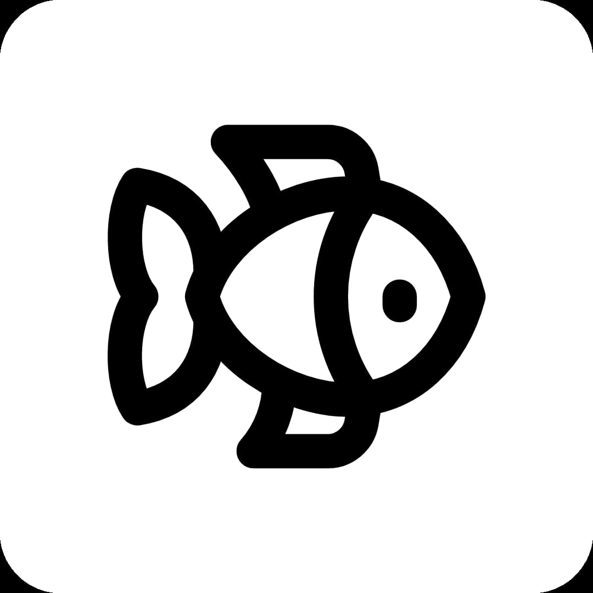

<!--
*** Thanks for checking out the Best-README-Template. If you have a suggestion
*** that would make this better, please fork the repo and create a pull request
*** or simply open an issue with the tag "enhancement".
*** Don't forget to give the project a star!
*** Thanks again! Now go create something AMAZING! :D
-->

<!-- PROJECT SHIELDS -->
<!--
*** I'm using markdown "reference style" links for readability.
*** Reference links are enclosed in brackets [ ] instead of parentheses ( ).
*** See the bottom of this document for the declaration of the reference variables
*** for contributors-url, forks-url, etc. This is an optional, concise syntax you may use.
*** https://www.markdownguide.org/basic-syntax/#reference-style-links
-->

<!-- [![Releases Version][releases-version-shield]][releases-version-url] -->

<!-- ![Top Lang][top-languages-shield] -->
<!-- [![Uptime][uptime-shield]][uptime-url] -->
<!-- [![Response Time][response-time-shield]][response-time-url] -->
[![Last Commit][last-commit-shield]][last-commit-url]
<!-- [![License][license-shield]][license-url] -->

<!-- PROJECT LOGO -->
 

  

<h3 align="center">Wordfishing 一語多吃</h3>

  

    開啟語言學習全新模式，累積語言感應力
     
    <a href="https://github.com/samko5sam/wordfishing"><strong>探索文件 »</strong></a>
     
     
    <a href="https://wordfishing.vercel.app">網頁應用程式</a>
    ·
    <a href="https://github.com/samko5sam/wordfishing/issues">回報錯誤</a>
    ·
    <a href="https://github.com/samko5sam/wordfishing/issues">功能提議</a>
  

🔗 [Git Repo][git-repo-short-url]

<!-- 
(<a href="#top">back to top</a>)
 -->

[releases-version-shield]: https://img.shields.io/github/v/release/samko5sam/wordfishing?style=for-the-badge
[releases-version-url]: https://github.com/samko5sam/wordfishing/releases
[last-commit-shield]: https://img.shields.io/github/last-commit/samko5sam/wordfishing?style=for-the-badge
[last-commit-url]: https://github.com/samko5sam/wordfishing/commits
[top-languages-shield]: https://img.shields.io/github/languages/top/samko5sam/wordfishing?style=for-the-badge
[uptime-shield]: https://img.shields.io/endpoint?url=https://raw.githubusercontent.com/samko5sam/uptime/master/api/wordfishing/uptime.json&style=for-the-badge
[uptime-url]: https://uptime.sk5s.cyou/history/wordfishing
[response-time-shield]: https://img.shields.io/endpoint?url=https://raw.githubusercontent.com/samko5sam/uptime/master/api/wordfishing/response-time.json&style=for-the-badge
[response-time-url]: https://uptime.sk5s.cyou/history/wordfishing
[license-shield]: https://img.shields.io/github/license/samko5sam/wordfishing.svg?style=for-the-badge
[license-url]: https://github.com/samko5sam/wordfishing/blob/main/LICENSE
[product-screenshot]: images/screenshot.png
[git-repo-short-url]: https://github.com/samko5sam/wordfishing

<!--
1. My repo: wordfishing
2. Uptime: wordfishing
-->